# 操作系统实验报告

## 实验基本信息

| 项目 | 内容 |
|------|------|
| **实验名称** | Lab 1：比麻雀更小的麻雀（最小可执行内核） |
| **小组成员** | 2132456759-刘国全 |
| **完成日期** | 2026-09-24 |

### 小组分工

本实验由刘国全独立完成。分工如下：

| 成员 | 负责的练习/模块 |
|------|----------------|
| 2132456759-刘国全 | 实验环境配置、源码阅读、练习 1、GDB 调试与练习 2、测试截图、实验报告与 Prompt 汇总 |

实验报告由刘国全负责整理和撰写。

---

## 一、实验目的

本实验的主要目的是：

1. 理解 QEMU 模拟的 RISC-V 计算机从加电复位到进入操作系统内核的启动流程。
2. 理解链接脚本、程序内存布局、内核入口点和启动栈之间的关系。
3. 掌握使用 RISC-V 交叉编译工具链生成内核 ELF 文件和裸二进制镜像的方法。
4. 理解 OpenSBI 作为固件和 bootloader 的作用，以及内核通过 SBI 调用固件服务的机制。
5. 掌握使用 QEMU 和 GDB 远程调试 RISC-V 内核的基本方法。
6. 通过 AI 辅助阅读代码、分析启动流程并记录 Prompt，形成“分析、验证、反馈、整理”的开发闭环。

本实验的重点不是增加复杂的内核功能，而是建立一个能够被正确加载、进入 C 语言入口并完成格式化输出的最小可执行内核。

---

## 二、实验环境

实验在 WSL2 的 Ubuntu 24.04.1 LTS 环境中完成，宿主机架构为 x86_64，目标架构为 RISC-V 64 位。

主要工具和版本如下：

| 项目 | 版本/路径 |
|------|-----------|
| 操作系统 | Ubuntu 24.04.1 LTS（WSL2） |
| 目标架构 | RISC-V 64 |
| 交叉编译器 | `riscv64-unknown-elf-gcc` 10.2.0 |
| 交叉调试器 | `riscv64-unknown-elf-gdb` 10.1 |
| 模拟器 | `qemu-system-riscv64` 5.1.0 |
| 固件 | OpenSBI v0.7 |
| 构建工具 | GNU Make 4.3 |
| 版本控制 | Git 2.43.0 |
| Node.js | 22.23.2 |
| AI 编程工具 | Codex（VS Code/终端 Agent） |
| 底层模型 | `deepseek-flash`，推理强度为 `high` |

AI 工具配置如下：

| 成员 | AI 编程工具 | 底层模型 | 备注 |
|------|------------|---------|------|
| 2132456759-刘国全 | Codex（VS Code/终端 Agent） | DeepSeek Flash（`deepseek-flash`） | 用于读取代码、给出分析和辅助检查环境 |

---

## 三、实验整体逻辑分析

### 3.1 本章节的逻辑主线

本实验围绕“如何从机器加电运行到一个最小可执行内核”这一问题展开。完整逻辑主线是：

```text
硬件复位
  -> MROM 初始化
  -> OpenSBI 初始化
  -> 加载内核镜像
  -> 跳转到内核入口 kern_entry
  -> 设置内核栈
  -> 进入 C 语言函数 kern_init
  -> 初始化 BSS
  -> 通过 SBI 输出字符
  -> 进入死循环
```

实验首先解决“内核放在哪里、从哪里开始执行”的问题，即内存布局、链接脚本和入口点；随后解决“如何让内核使用 C 语言运行环境”的问题，即启动栈和 `kern_entry`；最后解决“内核如何输出调试信息”的问题，即通过 OpenSBI 提供的 SBI 服务完成字符输出。没有这三部分，后续的异常处理、内存管理和进程管理都无法开始。

### 3.2 功能的逐步实现

1. **先建立正确的内存布局和入口点。**
   `tools/kernel.ld` 将内核基地址设置为 `0x80200000`，并指定入口符号为 `kern_entry`。这样 OpenSBI 或 QEMU 才能把镜像加载到正确位置，并从正确的指令开始执行。

2. **通过交叉编译生成目标文件。**
   Makefile 使用 `riscv64-unknown-elf-gcc` 编译 `.c` 和 `.S` 文件，使用 RISC-V 64 位的编译选项和 `-nostdinc`，避免依赖宿主机标准库。

3. **将目标文件链接为内核 ELF，再生成裸二进制。**
   链接器根据链接脚本组合代码段、只读数据段、数据段和 BSS，生成 `bin/kernel`；随后使用 `objcopy` 转换为 `bin/ucore.img`，供 QEMU 加载。

4. **在汇编入口中建立 C 语言运行环境。**
   `entry.S` 的 `kern_entry` 首先执行 `la sp, bootstacktop`，为内核准备启动栈；然后使用 `tail kern_init` 把控制权交给 C 语言入口。

5. **完成 C 语言初始化并输出调试信息。**
   `kern_init()` 负责清理未初始化数据区，然后通过 `cprintf()` 输出启动信息。输出最终经过 SBI 接口交给 OpenSBI，再显示在 QEMU 终端上。

6. **使用 GDB 验证启动过程。**
   通过 QEMU 的 `-S` 和 `-s` 参数，使虚拟 CPU 暂停并提供远程调试端口；再用 RISC-V GDB 连接，从复位地址 `0x1000` 跟踪到 OpenSBI 入口 `0x80000000`，最后观察内核入口 `0x80200000`。

---

## 四、实验内容与实现

本实验没有要求学生额外实现处理器启动、内存管理或中断功能，当前源码已经能够完成最小内核的启动和格式化输出。实验的主要内容是理解已有实现，并通过 GDB 验证启动流程。

### 4.1 功能模块：内核启动与输出

#### `kern/init/entry.S`

该文件是 OpenSBI 将控制权交给内核后执行的第一段代码。入口函数为 `kern_entry`：

```asm
kern_entry:
    la sp, bootstacktop
    tail kern_init
```

它完成了两个关键动作：

- 将启动栈顶地址装入栈指针 `sp`；
- 跳转到 C 语言函数 `kern_init()`。

#### `kern/init/init.c`

该文件提供内核初始化入口 `kern_init()`：

```c
int kern_init(void) {
    extern char edata[], end[];
    memset(edata, 0, end - edata);

    const char *message = "(THU.CST) os is loading ...\n";
    cprintf("%s\n\n", message);

    while (1)
        ;
}
```

它先使用 `memset()` 清理未初始化数据区，再通过 `cprintf()` 输出启动信息。最后的无限循环表示内核初始化完成后不返回。

#### `tools/kernel.ld`

链接脚本将内核基地址设置为：

```text
0x80200000
```

并指定入口：

```text
ENTRY(kern_entry)
```

其作用是决定代码、只读数据、数据段和 BSS 在 RISC-V 物理内存中的布局，使镜像能够被正确加载和执行。

#### SBI 与输出路径

格式化输出的调用链如下：

```text
kern_init
  -> cprintf
  -> vcprintf
  -> vprintfmt
  -> cputch
  -> cons_putc
  -> sbi_console_putchar
  -> ecall
  -> OpenSBI
  -> QEMU 终端
```

`libs/sbi.c` 中的 `sbi_call()` 使用 `ecall` 进入 OpenSBI。SBI 调用约定使用 `a7/x17` 传递功能号，使用 `a0-a2` 传递参数，并通过 `a0` 返回结果。这使得内核不需要直接操作 QEMU 的串口设备，也能完成基本输出。

#### 最终提示词

本实验没有生成新的内核功能代码，因此没有对代码实现进行多轮迭代。AI 主要用于代码阅读和调试指导，核心提示词如下：

```markdown
阅读 kern/init/entry.S 和 Lab1 的启动流程文档，结合 kernel.ld、
Makefile、OpenSBI 和 kern_init，说明 la sp, bootstacktop 与
tail kern_init 的执行结果和作用，并指出它们在启动链路中的位置。
```

```markdown
请给出在 WSL 中使用 QEMU 和 riscv64-unknown-elf-gdb 调试 Lab1
的具体步骤，要求能够观察到 0x1000、0x80000000 和 0x80200000，
并列出每一步应记录的 PC、反汇编和寄存器状态。
```

---

### 4.2 练习 1：理解内核启动中的程序入口操作

#### `la sp, bootstacktop` 完成了什么操作？

`la` 是 Load Address 伪指令。因此：

```asm
la sp, bootstacktop
```

的作用是把符号 `bootstacktop` 的地址加载到栈指针寄存器 `sp` 中，而不是把该地址处保存的内容加载到 `sp`。

`bootstacktop` 是启动栈的最高地址。RISC-V 的栈通常向低地址方向增长，因此内核栈的有效区间是：

```text
[bootstack, bootstacktop)
```

当前 `KSTACKPAGE = 2`，`PGSIZE = 4096`，所以启动栈大小为：

```text
2 × 4096 = 8192 字节 = 8 KiB
```

设置 `sp` 后，`kern_init()` 及其后续调用的 C 语言函数才能保存返回地址、局部变量和被调用者保存寄存器。

它的目的是：

1. 在进入 C 语言代码之前建立合法的内核栈；
2. 将 `sp` 指向栈空间顶部，给栈向下增长留出空间；
3. 满足页对齐和 RISC-V ABI 对栈指针对齐的要求；
4. 保证后续函数调用不会使用未初始化或无效的栈地址。

#### `tail kern_init` 完成了什么操作？

`tail` 是无条件尾跳转伪指令。它的作用是跳转到 `kern_init`，但不在 `ra` 中保存返回地址。它通常展开为类似：

```asm
auipc t1, ...
jalr  x0, t1, ...
```

因为目标寄存器是 `x0`，返回地址会被丢弃。

它的目的是：

1. 将控制权从汇编入口 `kern_entry` 转交给 C 语言函数 `kern_init()`；
2. 继续使用刚刚设置的启动栈；
3. 因为 `kern_init()` 被声明为 `noreturn`，并且最终进入无限循环，所以不需要返回 `entry.S`；
4. 使用尾跳转避免保存无用的返回地址。

总结：

- `la sp, bootstacktop`：建立 C 语言运行所需的启动栈；
- `tail kern_init`：不保存返回地址地进入 C 语言内核初始化函数。

---

### 4.3 练习 2：使用 GDB 验证启动流程

#### 调试方法

首先在一个终端中执行：

```bash
cd ~/OS2026/code
make
make debug
```

`make debug` 使用 QEMU 的 `-S` 参数让 CPU 启动后暂停，并使用 `-s` 参数在 `localhost:1234` 打开 GDB 远程调试接口。

在另一个终端中执行：

```bash
cd ~/OS2026/code
make gdb
```

GDB 会加载 `bin/kernel` 的调试符号，设置目标架构为 `riscv:rv64`，然后连接 QEMU 的 1234 端口。

#### 复位地址观察

连接后 GDB 显示停在了：

```text
0x0000000000001000
```

查看当前 PC 和反汇编：

```gdb
info registers pc
x/4i $pc
```

观察到：

```text
pc = 0x1000

0x1000: auipc t0,0x0
0x1004: addi  a2,t0,40
0x1008: csrr  a0,mhartid
0x100c: ld    a1,32(t0)
```

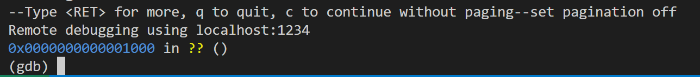

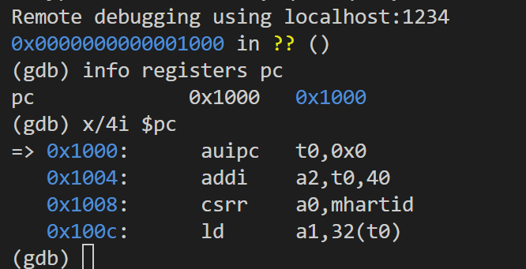

这说明 RISC-V 硬件复位后最初执行的指令位于 `0x1000`。这些初始指令不是操作系统内核代码，而是 QEMU 提供的复位固件/MROM 代码。它们主要负责准备 hart ID、设备树地址或其他启动参数，然后把控制权交给 OpenSBI。

#### OpenSBI 入口观察

在 GDB 中设置 OpenSBI 入口断点：

```gdb
b *0x80000000
c
```

GDB 停在：

```text
Breakpoint 1, 0x0000000080000000
```

此时查看 PC 和指令：

```gdb
info registers pc
x/4i $pc
```

观察到：

```text
pc = 0x80000000

0x80000000: add s0,a0,zero
0x80000004: add s1,a1,zero
0x80000008: add s2,a2,zero
0x8000000c: jal ra,0x80000618
```

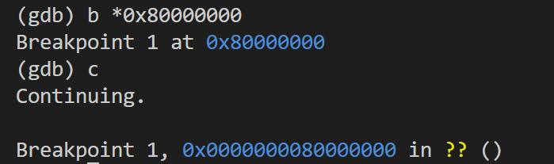

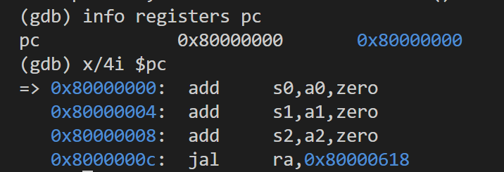

这表明控制权已经从 `0x1000` 处的复位代码转移到位于 `0x80000000` 的 OpenSBI。OpenSBI 运行在 RISC-V 的 M 模式，负责完成硬件初始化，并最终把内核的控制入口交给操作系统。

#### 内核入口观察

继续设置内核入口断点：

```gdb
b *0x80200000
c
```

GDB 停在：

```text
Breakpoint 2, kern_entry () at kern/init/entry.S:7
7    la sp, bootstacktop
```

查看 PC：

```gdb
info registers pc
x/4i $pc
```

观察到：

```text
pc = 0x80200000 <kern_entry>

0x80200000 <kern_entry>:     auipc sp,0x3
0x80200004 <kern_entry+4>:   mv    sp,sp
0x80200008 <kern_entry+8>:   j     0x8020000a <kern_init>
0x8020000a <kern_init>:      auipc a0,0x3
```

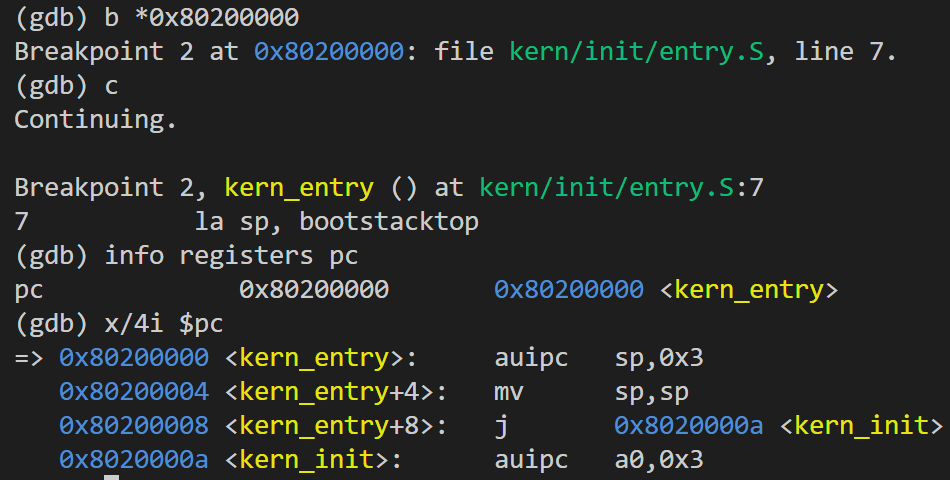

这里的 `auipc` 与后续指令对应 `la sp, bootstacktop` 的地址加载过程。当前链接结果中，`bootstacktop` 的低 12 位为 0，因此地址加载被展开为 `auipc` 加上零偏移调整，反汇编显示为 `mv sp,sp`，其实际作用是保持 `sp` 不变。根据符号表，`bootstacktop` 的地址是：

```text
0x80203000
```

单步执行后查看 `sp`：

```gdb
si
info registers sp
```

得到：

```text
sp = 0x80203000
```

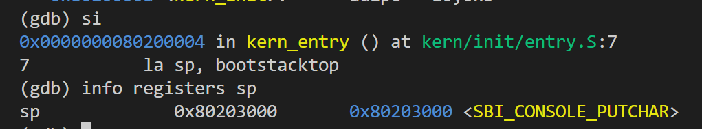

继续单步可以观察到 `tail kern_init` 的跳转过程，随后 GDB 停在：

```text
kern_init () at kern/init/init.c:8
8    memset(edata, 0, end - edata);
```

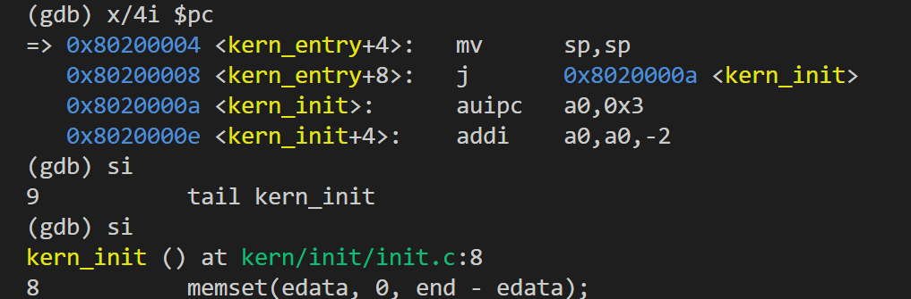

这说明启动链路已经成功地从开机复位进入最小内核的 C 语言初始化函数。

#### 练习 2 结论

RISC-V 硬件加电后最初执行的指令位于 `0x1000`。这些指令完成了复位后的基本参数准备，并将控制权交给 OpenSBI。OpenSBI 位于 `0x80000000`，完成硬件初始化后，内核从 `0x80200000` 开始执行。内核首先执行 `kern_entry` 设置启动栈，然后跳转到 `kern_init()`，建立最小 C 语言内核运行环境。

---

## 五、测试与验证

### 5.1 编译验证

执行：

```bash
cd ~/OS2026/code
make
```

编译成功后会生成：

```text
bin/kernel
bin/ucore.img
```

其中 `bin/kernel` 是 RISC-V ELF 可执行文件，`bin/ucore.img` 是去掉 ELF 头后的裸二进制镜像。

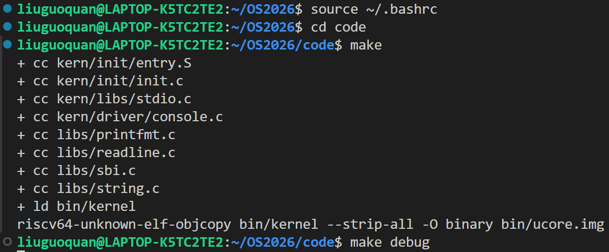

### 5.2 GDB 连接验证

执行 `make debug` 和 `make gdb` 后，GDB 成功连接 QEMU，并停在复位地址 `0x1000`。

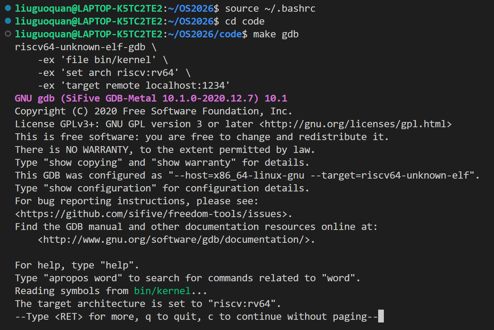

### 5.3 QEMU 启动验证

QEMU 启动后成功加载 OpenSBI，并最终输出：

```text
Platform Name : QEMU Virt Machine
(THU.CST) os is loading ...
```

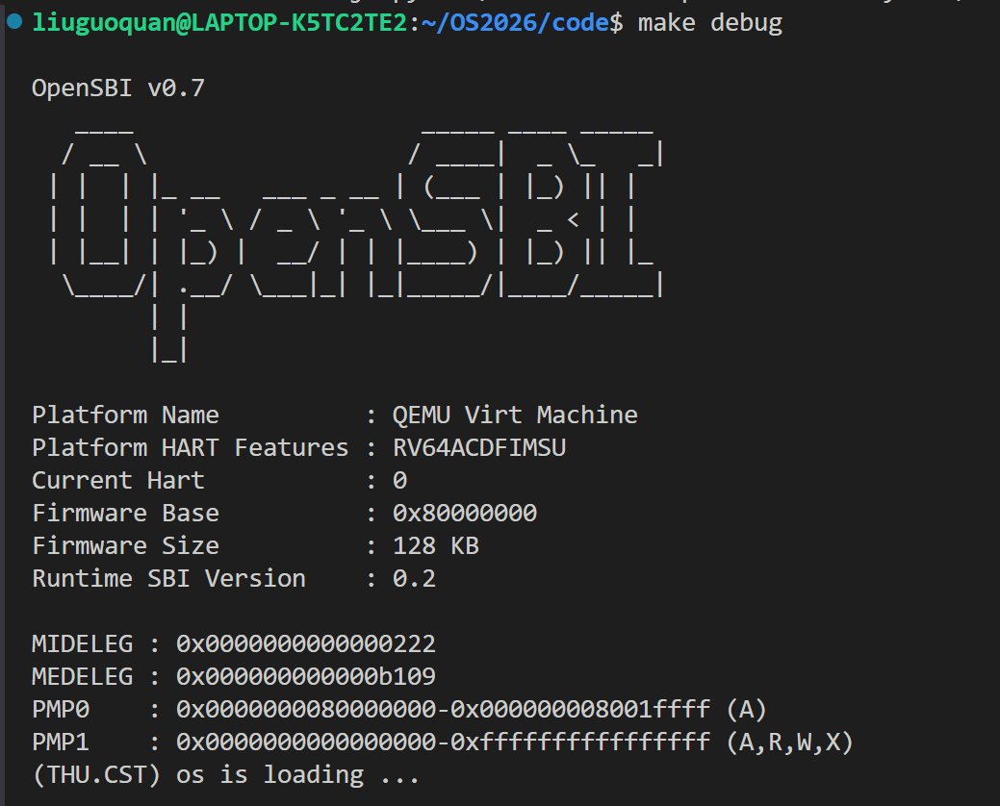

### 5.4 调试退出验证

完成观察后，可以使用：

```gdb
detach
quit
```

结束 GDB 调试。

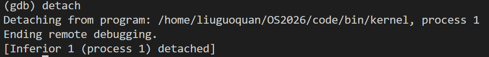

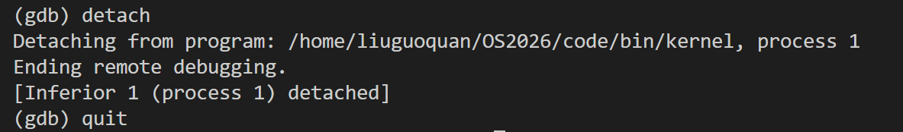

本实验学生端没有要求运行 `make grade`，评分脚本由助教负责，因此本节没有该命令的测试截图。

---

## 六、实验总结与收获

### 对操作系统的理解

本实验的重要知识点与操作系统原理的对应关系如下：

| 本实验知识点 | 对应的 OS 原理 | 含义、关系与差异 |
|--------------|----------------|------------------|
| MROM -> OpenSBI -> 内核 | 系统启动与 bootloader | 两者都经历“固件/引导程序加载内核”的过程；但本实验使用 QEMU 内置 OpenSBI，流程比真实 PC 的 UEFI + GRUB 简单。 |
| M 模式与 S 模式 | 特权级和内核态/用户态 | OpenSBI 运行在权限最高的 M 模式，内核通常运行在 S 模式；本实验只观察到启动阶段，还没有用户进程和系统调用。 |
| `kernel.ld` 与 `0x80200000` | 程序装入与地址空间 | 链接脚本决定内核的装入地址和入口点，是操作系统可执行文件形成过程的一部分；本实验还没有虚拟地址转换。 |
| `bootstacktop` 与 `sp` | 函数调用栈和 ABI | C 语言函数依赖栈保存局部变量、返回地址和寄存器；本实验的启动栈是内核最早的运行时数据结构之一。 |
| SBI `ecall` | 系统调用/内核服务接口 | 二者都通过受控调用跨越特权边界；但 SBI 是内核调用固件服务，系统调用是用户程序调用操作系统服务。 |
| `printfmt.c`、`string.c` | 内核基础库 | 裸机内核不能直接依赖普通 Linux libc，需要自己提供最小运行时函数；这些库为后续调试和内核功能提供基础。 |

### 本实验没有覆盖的重要 OS 知识点

本实验主要是启动阶段的最小内核，没有涉及：

1. 物理内存管理和页分配；
2. 虚拟内存、页表和地址空间隔离；
3. 中断、异常和时钟处理；
4. 进程、线程和上下文切换；
5. 调度算法；
6. 进程间同步和互斥；
7. 文件系统和设备驱动；
8. 用户态程序、系统调用和进程生命周期。

这些内容将在后续实验中逐步展开。

### AI 协作开发的经验

本次实验中，AI 主要用于：

- 梳理 Lab1 的启动链路；
- 解释 `entry.S`、链接脚本和 SBI 输出路径；
- 指导使用 QEMU 和 GDB 进行远程调试；
- 辅助检查工具链、QEMU 和 Git 环境；
- 根据 GDB 输出帮助分析 PC、指令和栈指针变化。

实际使用中最重要的经验是：

1. 不能只让 AI 给出结论，还需要用 `make`、QEMU 和 GDB 的输出进行验证；
2. 对地址、寄存器、调用约定等关键内容，要回到源码和调试结果核对；
3. Prompt 中应写清楚目标地址、观察点和预期结果，便于后续复盘；
4. AI 生成的解释需要人工判断，尤其是链接器重定位、启动地址和特权级相关概念。
